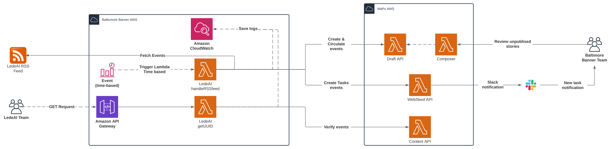

# LedeAI RSS feed integration

## This integration was discarded, however it was tested in the development environment working as expected. 

## Overview

This middleware was created to fit the LedeAI RSS feed integration requirements.
You have the possibility to generate a UUID to associate with a Story, as well as
to create Stories using the data from the LedeAI RSS feed.

## Installation

### Depencies

Make sure you have installed [NodeJSv16](https://nodejs.org/en/download/)

__If you want to install the NodeJSv16 with bash:__
```bash
curl "https://nodejs.org/dist/latest/node-${VERSION:-$(wget -qO- https://nodejs.org/dist/latest-v16.x/ | sed -nE 's|.*>node-(.*)\.pkg</a>.*|\1|p')}.pkg" > "$HOME/Downloads/node-latest.pkg" && sudo installer -store -pkg "$HOME/Downloads/node-latest.pkg" -target "/"

```

__If you want to install the NodeJSv16 with brew:__
```bash
brew install node@16
```

### Clone Repo

You must clone this repo and go to `middlewares/Lede_AI_Integration` folder, try with the following 
command:

```bash
git clone git@github.com:wizeline/Baltimore-Banner-Middlewares.git && cd ./Baltimore-Banner-Middlewares/middlewares/Lede_AI_Integration/
```

### Install packages

Install all packages used by the middleware with the command:

```bash
npm i
```

### Retrieve .env

Retrieve .env file from AWS SSM

```bash
npm run fetchSecrets
```

### Summary

This command will install Nodejsv16, download the repo, move to the middleware folder and 
install the packages used by the middleware:

```bash
curl "https://nodejs.org/dist/latest/node-${VERSION:-$(wget -qO- https://nodejs.org/dist/latest-v16.x/ | sed -nE 's|.*>node-(.*)\.pkg</a>.*|\1|p')}.pkg" > "$HOME/Downloads/node-latest.pkg" && sudo installer -store -pkg "$HOME/Downloads/node-latest.pkg" -target "/"  \
  && git clone git@github.com:wizeline/Baltimore-Banner-Middlewares.git \
  && cd ./Baltimore-Banner-Middlewares/middlewares/Lede_AI_Integration/
  && npm i \
  && npm run fetchSecrets
```

## Available Scripts

If you need more documentation about the scripts available for this middleware you can run:

```bash
npm run help
```

## Project structure

```bash
├── ./.husky
├── ./__mocks__
├── ./git-hooks
├── ./img
│   ├── ./img/aws-architecture-ledeai.svg
├── ./scripts
│   ├── ./scripts/manageSSM.js
│   ├── ./scripts/rss
│   └── ./scripts/testHandler.js
├── ./src
│   ├── ./src/constants
│   ├── ./src/index.ts
│   ├── ./src/types
│   ├── ./src/utils
│   └── ./src/webhook.ts
├── ./.env.yml
├── ./.eslintignore
├── ./.eslintrc
├── ./.prettierignore
├── ./.prettierrc.json
├── ./.secrets.example.yml
├── ./jest.config.ts
├── ./README.md
├── ./package-lock.json
├── ./package.json
└── ./tsconfig.json
```

## AWS Middleware Archirecture


## Thrid party Libraries installed

Below you will find a list of all third party libraries used in the app.

 - [dotenv](https://github.com/motdotla/dotenv) - License BSD-2-Clause
 - [hi-base32](https://github.com/emn178/hi-base32) - License MIT
 - [jsonwebtoken](https://github.com/auth0/node-jsonwebtoken) - License MIT
 - [node-fetch](https://github.com/node-fetch/node-fetch) - License MIT 
 - [rss-parser](https://github.com/rbren/rss-parser) - License MIT
 - [ts-node](https://github.com/TypeStrong/ts-node) - License MIT
 - [typescript](https://github.com/Microsoft/TypeScript) - License Apache-2.0
 - [uuid](https://github.com/uuidjs/uuid) - License MIT
